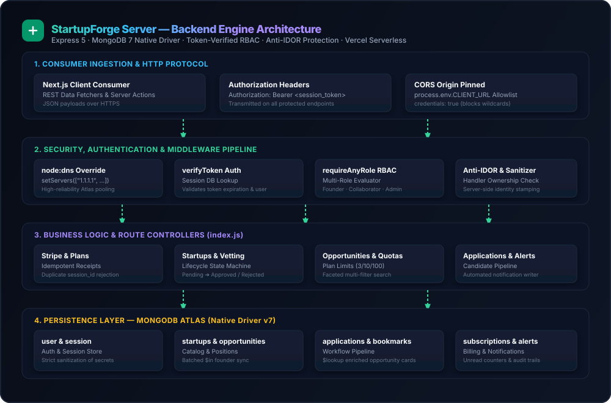
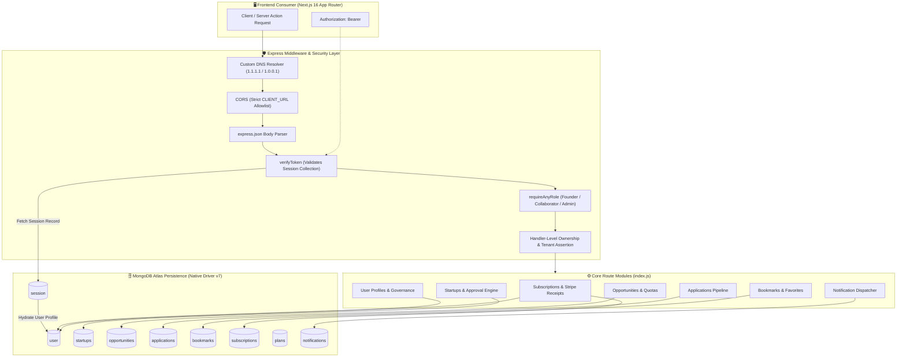

<div align="center">

  <picture>
    <source media="(prefers-color-scheme: dark)" srcset="./public/logo-wordmark-dark.svg">
    <source media="(prefers-color-scheme: light)" srcset="./public/logo-wordmark.svg">
    
  </picture>

  <br />
  <br />

  <h1>⚙️ StartupForge Server — Core REST API</h1>

  <p align="center">
    <strong>High-performance, role-guarded backend engine powering the StartupForge talent & co-founder ecosystem.</strong>
  </p>

  <p align="center">
    Built on <strong>Express 5</strong> and the native <strong>MongoDB 7 Driver</strong> (no ORM overhead). Delivers token-verified authentication, multi-tier RBAC authorization, complex aggregation pipelines, Stripe webhook subscription ingestion, and automated bidirectional notification dispatching.
  </p>

  <p align="center">
    <a href="https://startup-forge-server-nine.vercel.app/" target="_blank">
      
    </a>
    <a href="https://startupforgelimited.vercel.app" target="_blank">
      
    </a>
    <a href="./package.json">
      
    </a>
  </p>

  <p align="center">
    
    
    
    
    
    
    
  </p>

  <p align="center">
    <a href="#-quick-start">Quick Start</a> •
    <a href="#-core-engineering-pillars">Engineering Pillars</a> •
    <a href="#%EF%B8%8F-system-architecture">Architecture</a> •
    <a href="#-complete-api-reference">API Reference</a> •
    <a href="#-security--authentication-architecture">Security & RBAC</a> •
    <a href="#%EF%B8%8F-database-collections--aggregations">Database</a> •
    <a href="#-environment-variables">Configuration</a> •
    <a href="#-deployment-architecture">Deployment</a>
  </p>

</div>

<br />

---

## 📖 Table of Contents

- [Executive Overview](#-executive-overview)
- [Core Engineering Pillars](#-core-engineering-pillars)
- [System Architecture](#%EF%B8%8F-system-architecture)
- [Complete API Reference](#-complete-api-reference)
  - [System Health](#system-health)
  - [Subscriptions & Stripe Billing](#subscriptions--stripe-billing)
  - [Startups & Approval Pipeline](#startups--approval-pipeline)
  - [Opportunities & Role Management](#opportunities--role-management)
  - [Applications Workflow](#applications-workflow)
  - [Bookmarks & Saved Roles](#bookmarks--saved-roles)
  - [User Administration & Governance](#user-administration--governance)
  - [In-App Notifications](#in-app-notifications)
- [Security & Authentication Architecture](#-security--authentication-architecture)
- [Database Collections & Aggregations](#%EF%B8%8F-database-collections--aggregations)
- [Environment Variables](#-environment-variables)
- [Quick Start & Local Setup](#-quick-start--local-setup)
- [Deployment Architecture](#-deployment-architecture)
- [Author & License](#-author--license)

---

## 🌟 Executive Overview

The **StartupForge Server** is the mission-critical backend engine supporting the [StartupForge](https://startupforgelimited.vercel.app) platform. It manages all persistent business logic, role-aware entity relationships, and transactional workflows between:

1. **Founders**: Creating venture profiles, post-quota gated opportunities, and adjudicating candidate applications.
2. **Collaborators**: Discovering verified startups, optimistically bookmarking listings, and submitting vetted applications.
3. **Administrators**: Moderating startup submissions, auditing Stripe payment transactions, and enforcing platform moderation policies.

The server operates synchronously with the companion Next.js client: while the client handles authentication session creation via `better-auth`, this Express engine acts as the authoritative gatekeeper by **validating bearer session tokens directly against MongoDB Atlas** on every protected request.

---

## 💎 Core Engineering Pillars

| Pillar | Engineering Detail | System Advantage |
| :--- | :--- | :--- |
| **🚀 Native MongoDB Driver** | Uses `mongodb@^7.5.0` without Mongoose ODM abstractions; Stable API v1 (`strict: true`). | Transparent aggregation pipelines (`$lookup`, `$match`, `$facet`), lower memory overhead, and lightning-fast execution. |
| **🛡️ Token-Verified RBAC** | Custom `verifyToken` middleware resolves active bearer tokens against MongoDB `session` records. | Immediate token revocation detection with zero stale JWT session vulnerabilities. |
| **🔒 Strict Anti-IDOR Enforcement** | Every mutation checks ownership against `req.user.id` or `req.user.email` directly in the route handler. | Eliminates Insecure Direct Object References; users can never inspect or mutate foreign records. |
| **⚡ Smart Denormalization** | Founder credentials (`name`, `email`, `image`, `bio`) are stamped on startup & opportunity documents and re-synced in batch. | Eliminates N+1 database queries on public directory listings while preserving data privacy. |
| **🔔 Event-Driven Notifications** | Automatic dispatching of targeted in-app alerts on status changes (Application Accepted/Rejected, Startup Vetting, Plan Upgrades). | Real-time member awareness without requiring third-party webhook dependencies. |
| **🌐 Resilient Cloud Networking** | Hardcoded custom DNS lookup resolvers (`1.1.1.1` & `1.0.0.1`) initialized before database pooling. | Prevents transient DNS resolution failures when connecting to MongoDB Atlas within serverless environments. |

---

## 🏗️ System Architecture

<p align="center">
  <picture>
    <source media="(prefers-color-scheme: dark)" srcset="./public/architecture-dark.svg">
    <source media="(prefers-color-scheme: light)" srcset="./public/architecture-light.svg">
    
  </picture>
</p>

<details>
  <summary><b>🔍 View Raw Mermaid Architecture Source</b></summary>
  <br />



</details>

---

## 📡 Complete API Reference

### Auth & Permission Legend

| Badge | Meaning |
| :--- | :--- |
| `🔓 Public` | No authorization token required |
| `🪪 Token` | Requires valid session token (`Authorization: Bearer <token>`) |
| `🏢 Founder` | Authenticated account with `founder` or `admin` role |
| `🤝 Collaborator`| Authenticated account with `collaborator` or `admin` role |
| `👑 Admin` | Administrator access only (bypasses ownership checks) |

---

### System Health

| Method | Endpoint | Description | Auth |
| :--- | :--- | :--- | :--- |
| `GET` | `/` | API health check and server connectivity status probe. | `🔓 Public` |

---

### Subscriptions & Stripe Billing

| Method | Endpoint | Description | Auth |
| :--- | :--- | :--- | :--- |
| `POST` | `/api/subscriptions` | Ingests Stripe payment session, idempotently records receipt, updates user `plan`, and dispatches admin notifications. | `🪪 Token` |
| `GET` | `/api/subscriptions` | Returns all recorded subscription payment transactions sorted newest first (Admin ledger). | `👑 Admin` |
| `GET` | `/api/plans` | Retrieves platform plan definitions, quotas, and feature entitlements (`?plan_id=` filter supported). | `🪪 Token` |

---

### Startups & Approval Pipeline

| Method | Endpoint | Description | Auth |
| :--- | :--- | :--- | :--- |
| `POST` | `/api/startup` | Registers a new startup profile. Founder credentials stamped server-side; triggers admin review alerts. | `🏢 Founder` |
| `PATCH` | `/api/startup/:id` | Modifies or resubmits a startup profile (owner), or transitions status to `Approved` / `Rejected` (admin). Cascades status to opportunities. | `🪪 Owner` / `👑 Admin` |
| `DELETE` | `/api/startup/:id` | Permanently deletes a startup profile and verifies ownership. | `🪪 Owner` / `👑 Admin` |
| `GET` | `/api/my/startup` | Retrieves startups owned by the authenticated founder (`?startupId=` optional filter). | `🏢 Founder` |
| `GET` | `/api/startups` | Searchable startup catalog with faceted filters: `?search=`, `?industry=`, `?funding_stage=`, and `?page=&limit=`. | `🔓 Public` |
| `GET` | `/api/featured/startups` | Returns the 5 most recently created and verified startups for homepage strips. | `🔓 Public` |
| `GET` | `/api/startup/:id` | Returns complete details for a single startup by `ObjectId`. | `🔓 Public` |

---

### Opportunities & Role Management

| Method | Endpoint | Description | Auth |
| :--- | :--- | :--- | :--- |
| `POST` | `/api/opportunity` | Publishes a new open role for a verified startup. Enforces server-side founder identity stamping. | `🏢 Founder` |
| `PATCH` | `/api/opportunity/:id` | Edits an existing opportunity. Automatically syncs founder profile attributes upon update. | `🪪 Owner` / `👑 Admin` |
| `DELETE` | `/api/opportunity/:id` | Removes an opportunity listing after verifying ownership. | `🪪 Owner` / `👑 Admin` |
| `GET` | `/api/my/opportunities` | Returns all opportunities posted by the authenticated founder (`?startupId=` optional filter). | `🏢 Founder` |
| `GET` | `/api/opportunities` | Paginated opportunity directory with full-text regex search (`?search=`), `?workType=`, `?industry=`, and `?page=&limit=`. | `🔓 Public` |
| `GET` | `/api/featured/opportunities`| Fetches the 5 most recently posted active opportunities. | `🔓 Public` |
| `GET` | `/api/opportunity/:id` | Detailed view of a single opportunity record. | `🔓 Public` |

---

### Applications Workflow

| Method | Endpoint | Description | Auth |
| :--- | :--- | :--- | :--- |
| `POST` | `/api/application` | Submits candidate application to an opportunity. Stamps applicant credentials and dispatches alert to founder. | `🤝 Collaborator` |
| `PATCH` | `/api/application/:id` | Founders make `Accepted` or `Rejected` decisions. Automatically notifies candidate of status outcome. | `🏢 Founder` / `👑 Admin` |
| `GET` | `/api/founder/applications` | Returns all candidate applications submitted to the authenticated founder's startups. | `🏢 Founder` |
| `GET` | `/api/my/applications` | Returns the authenticated collaborator's applications enriched with opportunity details via `$lookup`. Blocks cross-user snooping. | `🤝 Collaborator` |
| `DELETE` | `/api/application/:id` | Withdraws or cancels an application (caller must be applicant, receiving founder, or admin). | `🪪 Owner` / `🏢 Founder` |

---

### Bookmarks & Saved Roles

| Method | Endpoint | Description | Auth |
| :--- | :--- | :--- | :--- |
| `POST` | `/api/bookmark` | Saves an opportunity to personal bookmarks. Idempotently returns existing bookmark if duplicate. | `🪪 Token` |
| `DELETE` | `/api/bookmark/:id` | Removes a saved bookmark record. Scoped strictly to the caller's `userId`. | `🪪 Owner` / `👑 Admin` |
| `GET` | `/api/my/bookmarks` | Returns all saved bookmarks for the authenticated collaborator. Prevents IDOR data leaks. | `🤝 Collaborator` |

---

### User Administration & Governance

| Method | Endpoint | Description | Auth |
| :--- | :--- | :--- | :--- |
| `GET` | `/api/user/profile/:id` | Retrieves sanitized member profile. Permitted only for self or platform admins. | `🪪 Self` / `👑 Admin` |
| `PATCH` | `/api/user/profile/:id` | Updates user profile fields (`name`, `image`, `skills`, `bio`) through a strict allowlist. | `🪪 Self` / `👑 Admin` |
| `PATCH` | `/api/user/:id` | Moderates user account status (e.g. `active` / `banned`). | `👑 Admin` |
| `GET` | `/api/users` | Returns list of platform users with sanitized sensitive credentials for administration console. | `👑 Admin` |

---

### In-App Notifications

| Method | Endpoint | Description | Auth |
| :--- | :--- | :--- | :--- |
| `GET` | `/api/notifications` | Returns the 30 most recent user notifications and aggregate `unreadCount`. Admins also receive broadcast alerts. | `🪪 Token` |
| `PATCH` | `/api/notifications/mark-all-read` | Marks all unread notifications as read for the authenticated caller. | `🪪 Token` |
| `PATCH` | `/api/notifications/:id/read` | Marks a single notification record as read after asserting caller ownership. | `🪪 Token` |

---

## 🔐 Security & Authentication Architecture

The server adopts a **Zero-Trust Security Model** tailored for distributed SaaS platforms:

### 1. External Session Verification
Instead of issuing stateless JWTs that cannot be revoked immediately, the API verifies bearer tokens against the `session` collection created by `better-auth`:
```javascript
// Verification extracts Bearer token, checks expiration, and hydrates user:
const sessionRecord = await sessionCollection.findOne({
  token: tokenString,
  expiresAt: { $gt: new Date() },
});
if (!sessionRecord) return res.status(401).json({ message: "Invalid or expired session" });
```

### 2. Multi-Role Evaluators
The `requireAnyRole` middleware accepts multiple allowable roles and prevents bypass exploits:
```javascript
const requireAnyRole = (...roles) => (req, res, next) => {
  const currentRole = String(req.user.role || req.user.accountType || "").toLowerCase();
  if (!roles.map(r => r.toLowerCase()).includes(currentRole)) {
    return res.status(403).json({ message: "Forbidden: insufficient permissions" });
  }
  next();
};
```

### 3. Server-Side Identity Stamping
Clients are **never** trusted to provide their own author, founder, or applicant ID in request payloads:
- `startupId`, `founderId`, `collaboratorId`, and `applicantEmail` are populated strictly from `req.user`.
- Even if a malicious user alters their client payload to target another account, the server overwrites the fields with verified session data.

### 4. Sensitive Field Stripping
All user documents returned by the API pass through a strict sanitization filter:
```javascript
const SENSITIVE_FIELDS = ["password", "passwordHash", "hashedPassword", "token", "sessionToken"];
```

---

## 🗄️ Database Collections & Aggregations

Operating on **MongoDB Atlas** using the native Node.js driver:

| Collection | Schema Focus | Critical Index & Query Pattern |
| :--- | :--- | :--- |
| `user` | Account credentials, persona (`founder` / `collaborator` / `admin`), `plan`, `status`. | Indexed on `email`, `role`, `accountType`. |
| `session` | Active `better-auth` tokens, user references, and `expiresAt` timestamps. | TTL index on `expiresAt` for automatic cleanup. |
| `startups` | Company profiles, funding stage, industry, website, logo URL, approval status. | Compound text index on `name`, `industry`, `description`. |
| `opportunities` | Open positions, title, requirements, salary/equity, work type, deadline, quotas. | Indexed on `startupId`, `workType`, `deadline`. |
| `applications` | Candidate resumes, pitch messages, current evaluation status (`Pending` / `Accepted` / `Rejected`). | Composite `$lookup` joining `opportunities` collection. |
| `bookmarks` | Saved positions keyed by `opportunityId` and `userId`. | Unique compound index on `{ opportunityId: 1, userId: 1 }`. |
| `subscriptions` | Stripe payment sessions, amount in cents, plan tier, currency, timestamps. | Unique index on `session_id` (idempotency barrier). |
| `plans` | Quota tiers definitions (e.g. Free Starter, Pro, Enterprise). | Keyed by `plan_id`. |
| `notifications` | In-app alerts, target `recipientId`, event type, message, read flags. | Indexed on `{ recipientId: 1, isRead: 1, createdAt: -1 }`. |

---

## 🔧 Environment Variables

Create a `.env` file in the root of `startup-forge-server/`:

```env
# -----------------------------------------------------------------------------
# HTTP RUNTIME CONFIGURATION
# -----------------------------------------------------------------------------
PORT=5000

# -----------------------------------------------------------------------------
# CORS SECURITY
# Pinned to client domain (No wildcards)
# -----------------------------------------------------------------------------
CLIENT_URL="http://localhost:3000"

# -----------------------------------------------------------------------------
# MONGODB ATLAS CONNECTION (Native Driver)
# -----------------------------------------------------------------------------
MONGODB_URI="mongodb+srv://<username>:<password>@cluster0.mongodb.net/?appName=Cluster0"
DB_NAME="StartupForge"
```

---

## 🚀 Quick Start & Local Setup

### Prerequisites
- **Node.js**: `v18.17.0` or newer
- **npm** or **pnpm**
- **MongoDB**: Local database or free [MongoDB Atlas Cluster](https://www.mongodb.com/cloud/atlas)

### 1. Clone & Navigate
```bash
git clone https://github.com/takebul/startup-forge-server.git
cd startup-forge-server
```

### 2. Install Dependencies
```bash
npm install
```

### 3. Configure Environment
Create a `.env` file matching the specifications above.

### 4. Start the Server
```bash
npm start
```

### 5. Verify Health Check
Open your terminal or browser:
```bash
curl http://localhost:5000/
# Output: "StartupForge server is running fine!"
```

---

## 🌐 Deployment Architecture

The server is configured for automated continuous deployment on **Vercel** via serverless lambdas:

- **Live URL**: [https://startup-forge-server-nine.vercel.app/](https://startup-forge-server-nine.vercel.app/)
- **Serverless Adapter**: [`vercel.json`](vercel.json) bundles `index.js` using `@vercel/node` and forwards all HTTP methods through a wildcard route:

```json
{
  "version": 2,
  "builds": [
    { "src": "index.js", "use": "@vercel/node" }
  ],
  "routes": [
    { "src": "/(.*)", "dest": "index.js", "methods": ["GET", "POST", "PUT", "PATCH", "DELETE", "OPTIONS"] }
  ]
}
```

- **Cloudflare DNS Resolver**: High-performance explicit DNS resolution (`1.1.1.1` and `1.0.0.1`) is configured at boot time to prevent cold-start latency when resolving MongoDB Atlas connection endpoints in serverless microVMs.

---

## 🧑‍💻 Author & License

**Takebul Islam**  
*Full-Stack Engineer building robust, scalable APIs and modern web applications.*

<p align="left">
  <a href="https://takebulislam.vercel.app/" target="_blank">
    
  </a>
  <a href="https://www.linkedin.com/in/takebulislam" target="_blank">
    
  </a>
  <a href="https://github.com/takebul" target="_blank">
    
  </a>
</p>

<br />

Distributed under the **ISC License** — see [package.json](./package.json) for full terms.
